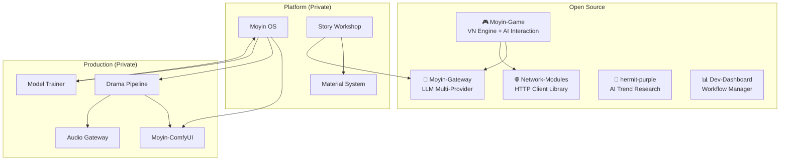

# Moyin Factory

> **AI-Powered IP Materialization Platform**
> *Your job is to write stories; AI handles the rest.*

[English](#overview) | [日本語](#概要) | [繁體中文](#概述)

---

## Overview

**Moyin** (沫引) is a modular platform that transforms story ideas into three concurrent product formats — novels, animated dramas, and interactive visual novels — all from a single IP core.

This repository serves as the **architecture hub** for the Moyin ecosystem, providing system design documentation, subsystem overviews, and architectural decision records.

## Ecosystem

### Open-Source Repositories

| Repository | Description | Tech |
|-----------|-------------|------|
| [**Moyin-Game**](https://github.com/AtsushiHarimoto/Moyin-game) | Visual novel engine with AI-driven dialogue and branching stories | Vue 3, TypeScript, Pinia |
| [**Moyin-Gateway**](https://github.com/AtsushiHarimoto/Moyin-gateway) | Unified LLM gateway (Grok, Gemini, OpenAI, Ollama) | Python, FastAPI |
| [**Network-Modules**](https://github.com/AtsushiHarimoto/Moyin-Network-modules) | Shared HTTP client with deduplication and retry | TypeScript, Vitest |
| [**hermit-purple**](https://github.com/AtsushiHarimoto/hermit-purple) | AI trend research tool with multi-source crawling | Python, Gemini API |
| [**Dev-Dashboard**](https://github.com/AtsushiHarimoto/Moyin-Dev-Dashboard) | Developer workflow and AI agent skills manager | React, Express, SQLite |

## Documentation

- [`docs/architecture/`](docs/architecture/) — System overview and glossary
- [`docs/subsystems/`](docs/subsystems/) — Individual subsystem overviews
- [`docs/decisions/`](docs/decisions/) — Architecture Decision Records (ADR)
- [`docs/roadmap/`](docs/roadmap/) — Development blueprint

## Key Technical Decisions

| Decision | Choice | Rationale |
|----------|--------|-----------|
| **LLM Integration** | Multi-provider gateway | Provider-agnostic; switch without code changes |
| **Game State** | Append-only commits | Deterministic replay; offline-first |
| **AI Role** | Proposal generator | LLM suggests; Judge validates; Engine commits |
| **Architecture** | Local-first | Privacy by default; cloud as optional expansion |
| **IP Management** | 6-level hierarchy (L0-L5) | Structured refinement from raw idea to production |

## Design Principles

1. **Local-First** — All services run locally by default
2. **AI as Proposal Generator** — LLM outputs are always validated before commitment
3. **IP Bible as Single Source** — One authoritative reference for all downstream systems
4. **Three-Line Equality** — Novel, Drama, and Game are equal product formats
5. **Extensible via Adapters** — New providers integrate without core changes

---

## 概要

**Moyin**（沫引）は、ストーリーのアイデアを小説・アニメドラマ・インタラクティブビジュアルノベルの3つの形式に同時変換するAI駆動のIP具現化プラットフォームです。

このリポジトリは、Moyinエコシステムの**アーキテクチャハブ**として、システム設計ドキュメント、サブシステム概要、アーキテクチャ決定記録を提供します。

### オープンソースリポジトリ

| リポジトリ | 説明 | 技術 |
|-----------|------|------|
| [**Moyin-Game**](https://github.com/AtsushiHarimoto/Moyin-game) | AI対話と分岐ストーリーのビジュアルノベルエンジン | Vue 3, TypeScript |
| [**Moyin-Gateway**](https://github.com/AtsushiHarimoto/Moyin-gateway) | 統合LLMゲートウェイ（Grok, Gemini, OpenAI, Ollama） | Python, FastAPI |
| [**Network-Modules**](https://github.com/AtsushiHarimoto/Moyin-Network-modules) | 重複排除とリトライ機能付きHTTPクライアント | TypeScript |
| [**hermit-purple**](https://github.com/AtsushiHarimoto/hermit-purple) | マルチソースAIトレンドリサーチツール | Python |
| [**Dev-Dashboard**](https://github.com/AtsushiHarimoto/Moyin-Dev-Dashboard) | 開発ワークフローとAIエージェントスキル管理 | React, Express |

### ドキュメント

- [`docs/architecture/`](docs/architecture/) — システム概要と用語集
- [`docs/subsystems/`](docs/subsystems/) — 各サブシステムの概要
- [`docs/decisions/`](docs/decisions/) — アーキテクチャ決定記録（ADR）
- [`docs/roadmap/`](docs/roadmap/) — 開発ロードマップ

### 主要な技術的決定

| 決定事項 | 選択 | 根拠 |
|----------|------|------|
| **LLM統合** | マルチプロバイダーゲートウェイ | プロバイダー非依存；コード変更なしで切り替え可能 |
| **ゲーム状態** | 追記専用コミット | 決定論的リプレイ；オフラインファースト |
| **AIの役割** | 提案生成器 | LLMが提案→Judgeが検証→Engineがコミット |
| **アーキテクチャ** | ローカルファースト | プライバシー優先；クラウドはオプション |
| **IP管理** | 6段階階層（L0-L5） | アイデアから本番までの構造化された精緻化 |

### 設計原則

1. **ローカルファースト** — 全サービスはデフォルトでローカル実行
2. **AIは提案生成器** — LLM出力はコミット前に必ず検証
3. **IP Bibleを唯一の情報源** — 全下流システムの権威ある参照元
4. **三ライン平等** — 小説・ドラマ・ゲームは同等の製品形式
5. **アダプターで拡張** — 新プロバイダーはコア変更なしで統合

---

## 概述

**Moyin**（沫引）是一個 AI 驅動的 IP 具現化平台，將故事創意同時轉化為小說、動畫短劇和互動視覺小說三種產品格式。

此倉庫作為 Moyin 生態系統的**架構中心**，提供系統設計文件、子系統概覽和架構決策記錄。

### 開源倉庫

| 倉庫 | 說明 | 技術 |
|------|------|------|
| [**Moyin-Game**](https://github.com/AtsushiHarimoto/Moyin-game) | AI 對話與分支故事的視覺小說引擎 | Vue 3, TypeScript |
| [**Moyin-Gateway**](https://github.com/AtsushiHarimoto/Moyin-gateway) | 統一 LLM 閘道（Grok, Gemini, OpenAI, Ollama） | Python, FastAPI |
| [**Network-Modules**](https://github.com/AtsushiHarimoto/Moyin-Network-modules) | 帶去重和重試的共用 HTTP 客戶端 | TypeScript |
| [**hermit-purple**](https://github.com/AtsushiHarimoto/hermit-purple) | 多源 AI 趨勢研究工具 | Python |
| [**Dev-Dashboard**](https://github.com/AtsushiHarimoto/Moyin-Dev-Dashboard) | 開發工作流與 AI 代理技能管理 | React, Express |

### 文件

- [`docs/architecture/`](docs/architecture/) — 系統概覽與術語表
- [`docs/subsystems/`](docs/subsystems/) — 各子系統概覽
- [`docs/decisions/`](docs/decisions/) — 架構決策記錄（ADR）
- [`docs/roadmap/`](docs/roadmap/) — 開發藍圖

### 關鍵技術決策

| 決策 | 選擇 | 理由 |
|------|------|------|
| **LLM 整合** | 多供應商閘道 | 供應商無關；無需改動程式碼即可切換 |
| **遊戲狀態** | 僅追加提交 | 確定性重播；離線優先 |
| **AI 角色** | 提案產生器 | LLM 提案→Judge 驗證→Engine 提交 |
| **架構** | 本機優先 | 預設保障隱私；雲端為選用擴展 |
| **IP 管理** | 6 層級階層（L0-L5） | 從原始創意到產品的結構化精煉 |

### 設計原則

1. **本機優先** — 所有服務預設在本機執行
2. **AI 為提案產生器** — LLM 輸出提交前必經驗證
3. **IP Bible 為唯一事實來源** — 所有下游系統的權威參照
4. **三線平等** — 小說、短劇、遊戲為同等產品格式
5. **透過轉接器擴展** — 新供應商無需更動核心即可整合

---

## License

This documentation is licensed under [CC BY-NC 4.0](https://creativecommons.org/licenses/by-nc/4.0/).

## Author

**Atsushi Harimoto** — [GitHub](https://github.com/AtsushiHarimoto)
