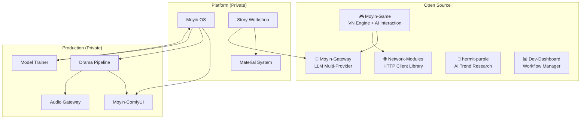

# Moyin Factory

[日本語](docs/README.ja.md) | [繁體中文](docs/README.zh-TW.md)

> **AI-Powered IP Materialization Platform**
> *Your job is to write stories. AI handles the rest.*

---

## Overview

**Moyin** (沫引) is a modular, creator-first platform that transforms a single story idea into three concurrent product formats — serialized novels, animated short dramas, and interactive visual novels — without requiring separate production pipelines.

This repository is the **architecture hub** of the Moyin ecosystem. It houses system design documentation, subsystem overviews, and Architecture Decision Records (ADRs) that define how every component fits together.

## Why Moyin?

Most creative tools treat novels, video, and games as separate workflows. Moyin treats them as three expressions of the same IP — synchronized, consistent, and produced in parallel from a shared story bible.

- **One source of truth** — a structured IP Bible drives every downstream format
- **AI as a collaborator, not a decision-maker** — LLM outputs are always validated before they are committed
- **Local-first by design** — your story data stays on your machine; the cloud is opt-in
- **Provider-agnostic** — swap LLM providers without touching your story logic

## Ecosystem

### Open-Source Repositories

| Repository | Description | Tech |
|-----------|-------------|------|
| [**Moyin-Game**](https://github.com/AtsushiHarimoto/Moyin-game) | Visual novel engine with AI-driven dialogue and branching stories | Vue 3, TypeScript, Pinia |
| [**Moyin-Gateway**](https://github.com/AtsushiHarimoto/Moyin-gateway) | Unified LLM gateway (Grok, Gemini, OpenAI, Ollama) | Python, FastAPI |
| [**Network-Modules**](https://github.com/AtsushiHarimoto/Moyin-Network-modules) | Shared HTTP client with deduplication and retry | TypeScript, Vitest |
| [**hermit-purple**](https://github.com/AtsushiHarimoto/hermit-purple) | AI trend research tool with multi-source crawling | Python, Gemini API |
| [**Dev-Dashboard**](https://github.com/AtsushiHarimoto/Moyin-Dev-Dashboard) | Developer workflow and AI agent skills manager | React, Express, SQLite |

## Documentation

- [`docs/architecture/`](docs/architecture/) — System overview and glossary
- [`docs/subsystems/`](docs/subsystems/) — Individual subsystem overviews
- [`docs/decisions/`](docs/decisions/) — Architecture Decision Records (ADR)
- [`docs/roadmap/`](docs/roadmap/) — Development blueprint

## Key Technical Decisions

| Decision | Choice | Rationale |
|----------|--------|-----------|
| **LLM Integration** | Multi-provider gateway | Provider-agnostic; switch without code changes |
| **Game State** | Append-only commits | Deterministic replay; offline-first |
| **AI Role** | Proposal generator | LLM suggests; Judge validates; Engine commits |
| **Architecture** | Local-first | Privacy by default; cloud as optional expansion |
| **IP Management** | 6-level hierarchy (L0-L5) | Structured refinement from raw idea to production |

## Design Principles

1. **Local-First** — All services run locally by default
2. **AI as Proposal Generator** — LLM outputs are always validated before commitment
3. **IP Bible as Single Source** — One authoritative reference for all downstream systems
4. **Three-Line Equality** — Novel, Drama, and Game are equal product formats
5. **Extensible via Adapters** — New providers integrate without core changes

---

## License

This documentation is licensed under [CC BY-NC 4.0](https://creativecommons.org/licenses/by-nc/4.0/).

## Author

**Atsushi Harimoto** — [GitHub](https://github.com/AtsushiHarimoto)
