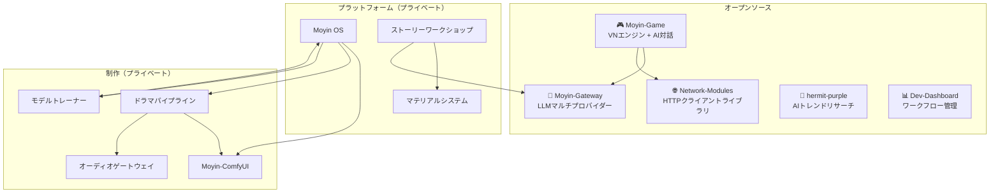

# Moyin Factory

[English](../README.md) | [繁體中文](README.zh-TW.md)

> **AIが駆動するIP具現化プラットフォーム**
> *あなたの仕事はストーリーを書くこと。残りはAIが担う。*

---

## 概要

**Moyin**（沫引）は、クリエイターを中心に設計されたモジュール型プラットフォームです。ひとつのストーリーアイデアから、連載小説・アニメ短編ドラマ・インタラクティブビジュアルノベルという3つの製品フォーマットを、それぞれ独立したパイプラインを構築することなく同時生成します。

このリポジトリは、Moyinエコシステムの**アーキテクチャハブ**です。すべてのコンポーネントがどのように連携するかを定義するシステム設計ドキュメント、サブシステム概要、およびアーキテクチャ決定記録（ADR）を管理します。

## なぜMoyinなのか

一般的なクリエイティブツールは、小説・映像・ゲームをそれぞれ独立したワークフローとして扱います。Moyinはそれらを同一IPの3つの表現形式として統一し、共有ストーリーバイブルから一貫性を保ちながら並行制作を実現します。

- **唯一の情報源** — 構造化されたIPバイブルがすべての下流フォーマットを駆動する
- **AIは協働者であり、決定者ではない** — LLMの出力はコミット前に必ず検証される
- **ローカルファーストの設計** — ストーリーデータはあなたのマシンに留まる。クラウドはオプトイン
- **プロバイダー非依存** — ストーリーロジックに触れることなくLLMプロバイダーを切り替え可能

## エコシステム

### オープンソースリポジトリ

| リポジトリ | 説明 | 技術スタック |
|-----------|------|------------|
| [**Moyin-Game**](https://github.com/AtsushiHarimoto/Moyin-game) | AI対話と分岐ストーリーを備えたビジュアルノベルエンジン | Vue 3, TypeScript, Pinia |
| [**Moyin-Gateway**](https://github.com/AtsushiHarimoto/Moyin-gateway) | 統合LLMゲートウェイ（Grok, Gemini, OpenAI, Ollama対応） | Python, FastAPI |
| [**Network-Modules**](https://github.com/AtsushiHarimoto/Moyin-Network-modules) | 重複排除とリトライ機能付き共有HTTPクライアント | TypeScript, Vitest |
| [**hermit-purple**](https://github.com/AtsushiHarimoto/hermit-purple) | マルチソースクローリングによるAIトレンドリサーチツール | Python, Gemini API |
| [**Dev-Dashboard**](https://github.com/AtsushiHarimoto/Moyin-Dev-Dashboard) | 開発ワークフローとAIエージェントスキルマネージャー | React, Express, SQLite |

## ドキュメント

- [`docs/architecture/`](architecture/) — システム概要と用語集
- [`docs/subsystems/`](subsystems/) — 各サブシステムの詳細概要
- [`docs/decisions/`](decisions/) — アーキテクチャ決定記録（ADR）
- [`docs/roadmap/`](roadmap/) — 開発ロードマップ

## 主要な技術的決定

| 決定事項 | 選択 | 根拠 |
|----------|------|------|
| **LLM統合** | マルチプロバイダーゲートウェイ | プロバイダー非依存；コード変更なしで切り替え可能 |
| **ゲーム状態** | 追記専用コミット | 決定論的リプレイ；オフラインファースト |
| **AIの役割** | 提案生成器 | LLMが提案 → Judgeが検証 → Engineがコミット |
| **アーキテクチャ** | ローカルファースト | プライバシー優先；クラウドはオプション拡張 |
| **IP管理** | 6段階階層（L0-L5） | 原石のアイデアから本番制作までの構造化精緻化 |

## 設計原則

1. **ローカルファースト** — 全サービスはデフォルトでローカル実行
2. **AIは提案生成器** — LLMの出力はコミット前に必ず検証される
3. **IP Bibleを唯一の情報源に** — すべての下流システムの権威ある参照元
4. **三ライン平等** — 小説・ドラマ・ゲームは同等の製品フォーマット
5. **アダプターによる拡張** — 新しいプロバイダーはコア変更なしで統合可能

---

## ライセンス

このドキュメントは [CC BY-NC 4.0](https://creativecommons.org/licenses/by-nc/4.0/) のもとで公開されています。

## 作者

**Atsushi Harimoto** — [GitHub](https://github.com/AtsushiHarimoto)
