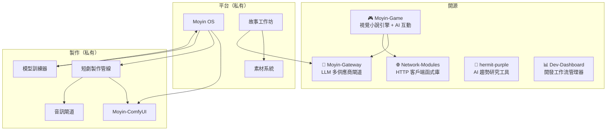

# Moyin Factory

[English](../README.md) | [日本語](README.ja.md)

> **AI 驅動的 IP 具現化平台**
> *你的工作是寫故事，其餘的交給 AI。*

---

## 概述

**Moyin**（沫引）是一個以創作者為核心的模組化平台，能將單一故事創意同時具現為三種產品格式：連載小說、動畫短劇，以及互動式視覺小說——無需為每種格式建立獨立的製作流程。

此倉庫是 Moyin 生態系統的**架構中心**，收錄系統設計文件、子系統概覽，以及定義各組件協作方式的架構決策記錄（ADR）。

## 為什麼選擇 Moyin？

大多數創作工具將小說、影像與遊戲視為相互獨立的工作流程。Moyin 則將它們視為同一 IP 的三種表達形式——以共享的故事聖典（Story Bible）為核心，確保一致性，並實現並行製作。

- **單一事實來源** — 結構化的 IP Bible 驅動所有下游格式，確保品牌與世界觀的一致性
- **AI 是協作者，而非決策者** — LLM 輸出在提交前必經人工驗證，創作主導權始終在你手中
- **本機優先設計** — 你的故事數據留在你的機器上；雲端為選用擴展
- **供應商無關** — 無需更動故事邏輯，即可自由切換 LLM 供應商

## 生態系統

### 開源倉庫

| 倉庫 | 說明 | 技術棧 |
|------|------|--------|
| [**Moyin-Game**](https://github.com/AtsushiHarimoto/Moyin-game) | 具備 AI 對話與分支故事的視覺小說引擎 | Vue 3, TypeScript, Pinia |
| [**Moyin-Gateway**](https://github.com/AtsushiHarimoto/Moyin-gateway) | 統一 LLM 閘道（支援 Grok, Gemini, OpenAI, Ollama） | Python, FastAPI |
| [**Network-Modules**](https://github.com/AtsushiHarimoto/Moyin-Network-modules) | 附去重與重試機制的共用 HTTP 客戶端 | TypeScript, Vitest |
| [**hermit-purple**](https://github.com/AtsushiHarimoto/hermit-purple) | 多源爬取的 AI 趨勢研究工具 | Python, Gemini API |
| [**Dev-Dashboard**](https://github.com/AtsushiHarimoto/Moyin-Dev-Dashboard) | 開發工作流與 AI 代理技能管理器 | React, Express, SQLite |

## 文件

- [`docs/architecture/`](architecture/) — 系統概覽與術語表
- [`docs/subsystems/`](subsystems/) — 各子系統詳細概覽
- [`docs/decisions/`](decisions/) — 架構決策記錄（ADR）
- [`docs/roadmap/`](roadmap/) — 開發藍圖

## 關鍵技術決策

| 決策 | 選擇 | 理由 |
|------|------|------|
| **LLM 整合** | 多供應商閘道 | 供應商無關；無需更動程式碼即可切換 |
| **遊戲狀態** | 僅追加提交（Append-only） | 確定性重播；離線優先 |
| **AI 角色** | 提案產生器 | LLM 提案 → Judge 驗證 → Engine 提交 |
| **架構** | 本機優先 | 預設保障隱私；雲端為選用擴展 |
| **IP 管理** | 6 層級階層（L0–L5） | 從原始創意到製作成品的結構化精煉流程 |

## 設計原則

1. **本機優先** — 所有服務預設在本機執行，無需網路連線
2. **AI 為提案產生器** — LLM 輸出提交前必經驗證，創作主導權不外讓
3. **IP Bible 為唯一事實來源** — 所有下游系統的權威參照，確保世界觀一致
4. **三線平等** — 小說、短劇、視覺小說為同等重要的產品格式
5. **透過轉接器擴展** — 新供應商或新格式無需更動核心即可整合

---

## 授權

本文件依 [CC BY-NC 4.0](https://creativecommons.org/licenses/by-nc/4.0/) 授權條款公開。

## 作者

**Atsushi Harimoto** — [GitHub](https://github.com/AtsushiHarimoto)
