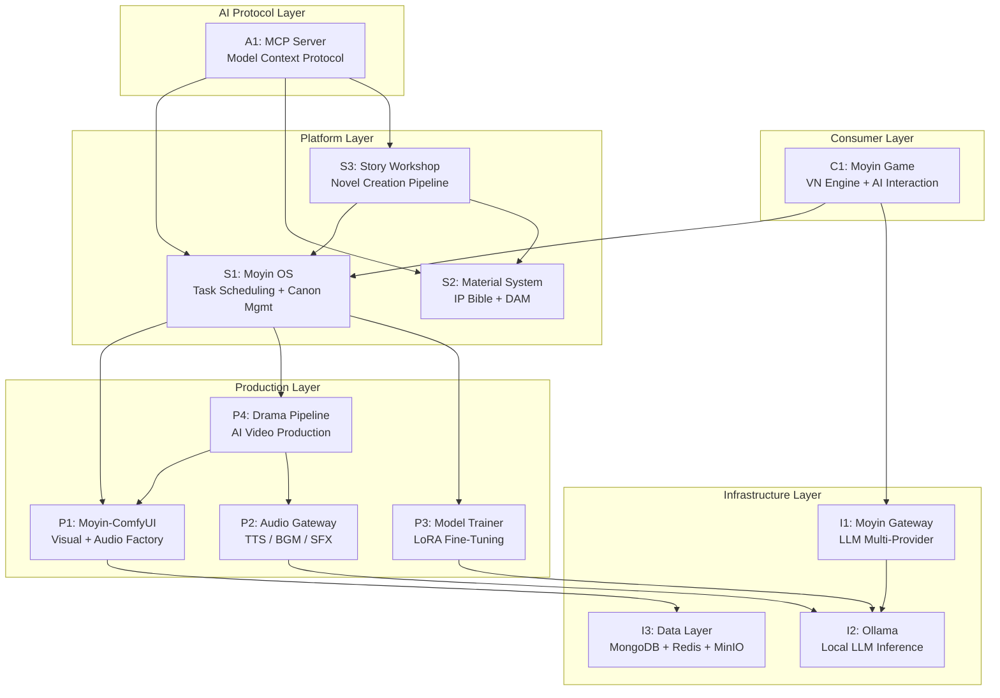
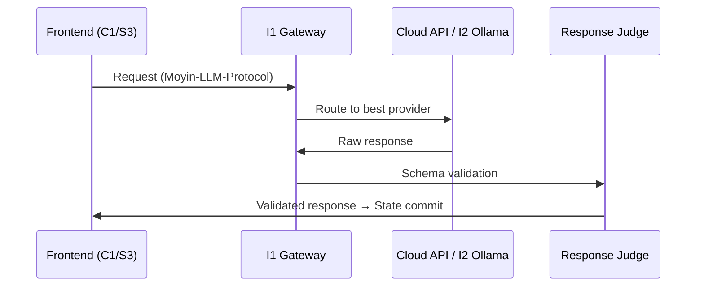

# Moyin System Architecture

## Overview

**Moyin** (沫引) is an AI-powered IP materialization platform that transforms story ideas into three concurrent product formats — novels, animated dramas, and interactive visual novels — all from a single IP core.

**Core Vision**: *"Your job is to write stories; AI handles the rest."*

## Architecture Layers

## Three-Line Parallel Production

The same IP core simultaneously drives three product lines:

| Line | System | Output |
|------|--------|--------|
| **Novel** | S3 Story Workshop | AI-assisted novels, ebooks |
| **Drama** | P4 Drama Pipeline | Anime-style short dramas |
| **Game** | C1 Moyin Game | Interactive branching VN |

## Dual-Channel Architecture

- **Human Channel**: Users interact via REST/WebSocket APIs on web/client UIs
- **AI Channel**: AI agents interact via MCP (Model Context Protocol)

## IP Material Hierarchy

Content flows through six refinement levels:

| Level | Name | Description |
|-------|------|-------------|
| L0 | Raw Inspiration | Notes, reference images, voice memos |
| L1 | Organized Materials | Tagged, partially processed inputs |
| L2 | IP Core | Story settings, character profiles, world-building |
| L3 | Assets | Character art, backgrounds, voice files |
| L4 | Manifest | Versioned asset collection for publication |
| L5 | Training Data | Datasets for LoRA model fine-tuning |

## Design Principles

1. **Local-First** — Default to local execution; cloud APIs as optional expansion
2. **Separation of Concerns** — Each subsystem owns a clear domain
3. **AI as Proposal Generator** — LLM outputs suggestions; deterministic rules enforce final state
4. **IP Bible as Single Source** — S2 is the authoritative reference for all downstream systems
5. **Three-Line Equality** — Novel, Drama, Game lines treated as equal product formats
6. **Human in the Loop** — Critical nodes require human intervention
7. **Extensible Architecture** — New providers integrated via adapter pattern

## Communication Patterns

| Pattern | Technology | Use Case |
|---------|-----------|----------|
| Synchronous | REST API | CRUD, sync queries |
| Real-time | WebSocket | Task progress, events |
| Async workflows | Temporal | Long-running GPU tasks |
| Event bus | Redis Pub/Sub | State changes, notifications |

## LLM Request Flow

